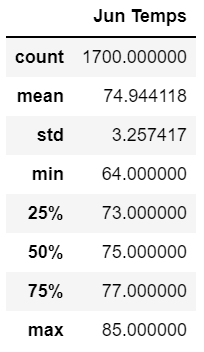
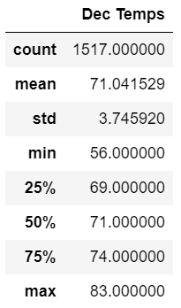

# Hawaii Weather

## Overview
Purpose

## Results

Reviewing the statistics date for temperatures in June and December, you can see several differences.

&nbsp; 

* December has a wider range of temperatures. You can see that it has a larger standard deviation, and 27 degrees difference between the high and low temps. Where as June is only a 21 degree spread.
* The average temperature in June is about 4 degrees higher than in December.
* The June middle temperatures for each quartile are all higher than in December. Confirming that it is generally colder in December.

## Summary

Overall, as expected the temperatures in December are a bit cooler than they are in June. However, It is still on average in the low-70's for temps. Running additional queries to find the median and mode temps shows that those values are essentially the same as the average temp for each month.

June: 
  Mean Temp - 74.9, Median Temp - 75, Mode Temp - 76  
December: 
  Mean Temp - 71, Median Temp - 71, Mode Temp - 71

